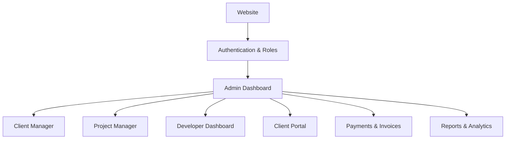

# 🧩 CodeNexus Studio – Complete Module Architecture

This document outlines the complete architectural modules for **CodeNexus Studio**, a centralized platform for managing clients, projects, developers, and the company's core operations.

---

## 🔹 MODULE 1: Public Website (Client Facing)
> 👉 **Purpose:** The primary landing point for normal visitors and potential clients.

**Pages:**
- Home
- About Us
- Services
- Portfolio
- Pricing
- Contact Us
- Login (Admin / Client / Developer / Manager)

**Features:**
- Service inquiry form
- WhatsApp / Email Call-to-Action (CTA)
- SEO-friendly pages
- Responsive UI/UX

📌 **Output:** Lead generation and brand presence.

---

## 🔹 MODULE 2: Authentication & Role Management (Core)
> 👉 **Purpose:** The foundational security layer for all dashboards.

**Roles:**
- **Admin:** Master control
- **Manager:** Operational control (Optional)
- **Developer:** Project execution
- **Client:** View-only access to their projects

**Features:**
- Login / Logout functionality
- JWT Authentication
- Role-Based Access Control (RBAC)
- Forgot / Reset Password workflow
- Secure session handling

📌 **Output:** A secure and access-controlled system.

---

## 🔹 MODULE 3: Admin Dashboard (Control Center)
> 👉 **Purpose:** The "Brain" of the company 🧠.

**Sub-modules:**
- Dashboard & Overview Analytics
- Client Manager
- Project Manager
- Developer Manager
- Payments & Invoices
- CMS Operations
- Reports & Analytics
- System Settings

📌 **Output:** Full operational control and visibility.

---

## 🔹 MODULE 4: Client Manager (CRM Lite)
> 👉 **Purpose:** Managing client relationships and histories.
> 📌 **Used by:** Admin, Manager

**Features:**
- Comprehensive client profiles
- Client status tracking (Lead / Active / Completed)
- Project mapping per client
- Payment and revenue overview per client
- Internal notes and follow-up logging

---

## 🔹 MODULE 5: Project Management
> 👉 **Purpose:** Tracking the execution of services and projects.
> 📌 **Used by:** Admin, Manager (Full Access) | Developer (View & Update Tasks)

**Features:**
- Project creation and setup
- Service type mapping
- Project phases and milestones
- Deadline tracking
- Overall progress tracking
- Relevant file linking

---

## 🔹 MODULE 6: Developer Dashboard
> 👉 **Purpose:** The execution layer for technical staff.
> 📌 **Used by:** Developer

**Features:**
- View assigned projects
- Personal task management
- Status updates and commits
- File uploads and deliverables submission
- Daily work logs / Timesheets
- Relevant notifications

---

## 🔹 MODULE 7: Task Management System
> 👉 **Purpose:** The productivity and execution engine.
> 📌 **Linked with:** Projects & Developers

**Features:**
- Task creation and assignment
- Priority sorting and deadline setting
- Status workflow (To-Do, In Progress, Review, Done)
- Kanban board view (Optional but recommended)
- Task activity logs and comments

---

## 🔹 MODULE 8: Client Portal
> 👉 **Purpose:** Building client trust through transparency.
> 📌 **Used by:** Client (Mostly Read-Only)

**Features:**
- Live project status and milestone view
- Secure file downloads (Deliverables)
- Invoice viewing and downloading
- Payment summary and history
- Support tickets and messaging

---

## 🔹 MODULE 9: File Management System
> 👉 **Purpose:** Centralized and secure storage for digital assets.
> 📌 **Used by:** Admin, Developer (Upload/Download) | Client (Download Only)

**Features:**
- Secure upload / download functionality
- Project-wise folder structuring
- Role-based file access
- Basic version controlling for deliverables

---

## 🔹 MODULE 10: Payment & Invoice Module
> 👉 **Purpose:** Handling the business financials 💰.
> 📌 **Used by:** Admin, Manager

**Features:**
- Automated Invoice generation (PDF format)
- Payment status tracking (Paid, Pending, Overdue)
- High-level revenue reporting
- Due payment tracking and alerts

---

## 🔹 MODULE 11: Communication Module
> 👉 **Purpose:** Internal and external system communication.

**Features:**
- Admin ↔ Developer internal notes
- Client support ticketing system
- Task-specific comments
- Internal communication history logs

---

## 🔹 MODULE 12: CMS (Content Management)
> 👉 **Purpose:** Managing website content dynamically without code changes.

**Features:**
- Editing the Services page
- Adding/Editing Portfolio items
- Creating Blog posts (Optional Phase 2)
- Managing client Testimonials

---

## 🔹 MODULE 13: Notification System
> 👉 **Purpose:** Keeping everyone updated with alerts & reminders.

**Features:**
- New task assigned alerts
- Deadline approaching reminders
- Payment due reminders
- File upload/approval alerts

**Channels:**
- In-app notifications
- Email notifications (Phase 2)

---

## 🔹 MODULE 14: Reports & Analytics
> 👉 **Purpose:** Data-driven decision-making.

**Key Reports:**
- Active vs. Churn clients
- Revenue and cash flow
- Overall project completion status
- Developer productivity metrics
- Monthly/Quarterly growth

---

## 🔹 MODULE 15: Settings & Configuration
> 👉 **Purpose:** System-level customization.

**Features:**
- Company profile management (Name, Address, Tax info)
- Logo & branding styling
- Global roles & permissions configuration
- Database backup and data export tools

---

## 🗂️ Module Dependency Flow (Architecture)

---

## 🛠️ Recommended Build Order (Agile Approach)

For a smooth development lifecycle, prioritize building in this sequence:

1. **Public Website** (To start generating leads immediately)
2. **Auth + Roles** (Core foundation)
3. **Admin Dashboard MVP** (Basic layout and routing)
4. **Client Manager** (Store the leads)
5. **Project + Task System** (Start executing work)
6. **Developer Dashboard** (Onboard the team)
7. **Client Portal** (Onboard the clients for transparency)
8. **Payments & Reports** (Scale and track financials)

---

## 💡 MVP Pro-Tip (Real-World Strategy)

> **Build the Minimum Viable Product (MVP) first!**
> Focus on getting the **Admin**, **Developer**, and basic **Client** dashboards functioning with essential features (CRUD operations). Advanced functionalities like analytics, kanban boards, and email notifications can be introduced in Phase 2 or Phase 3.
